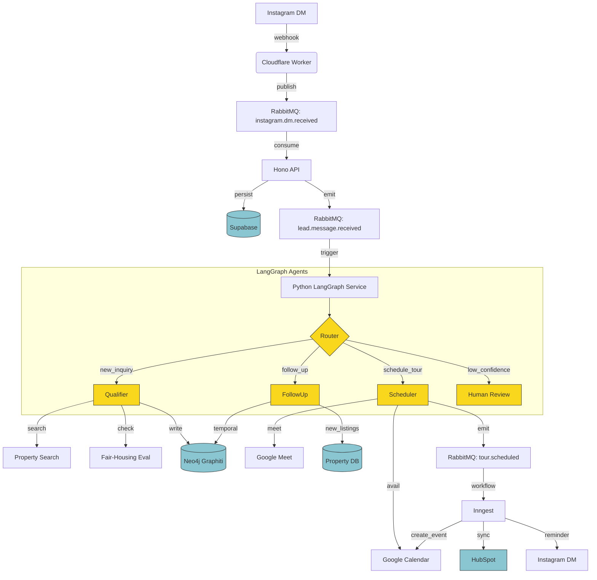
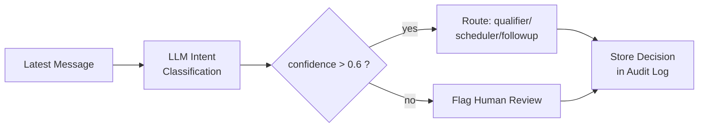
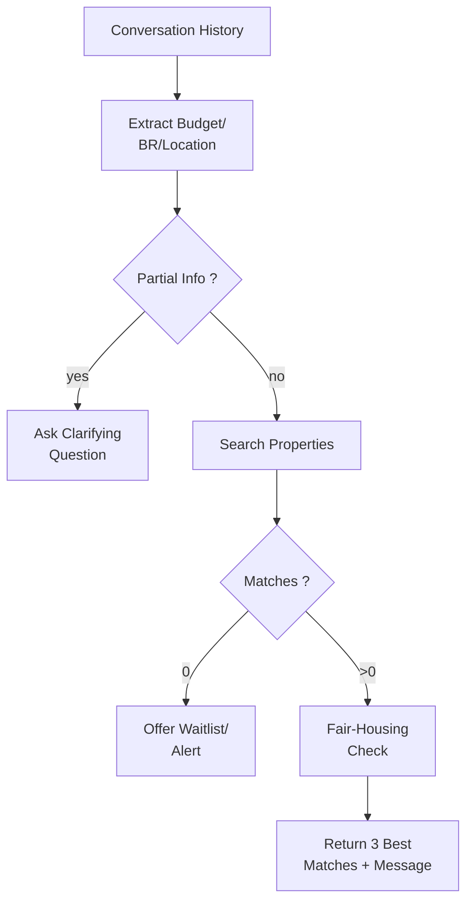
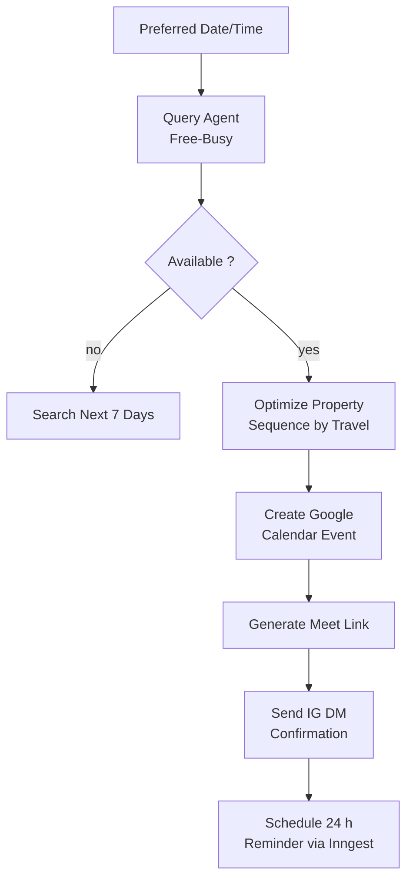
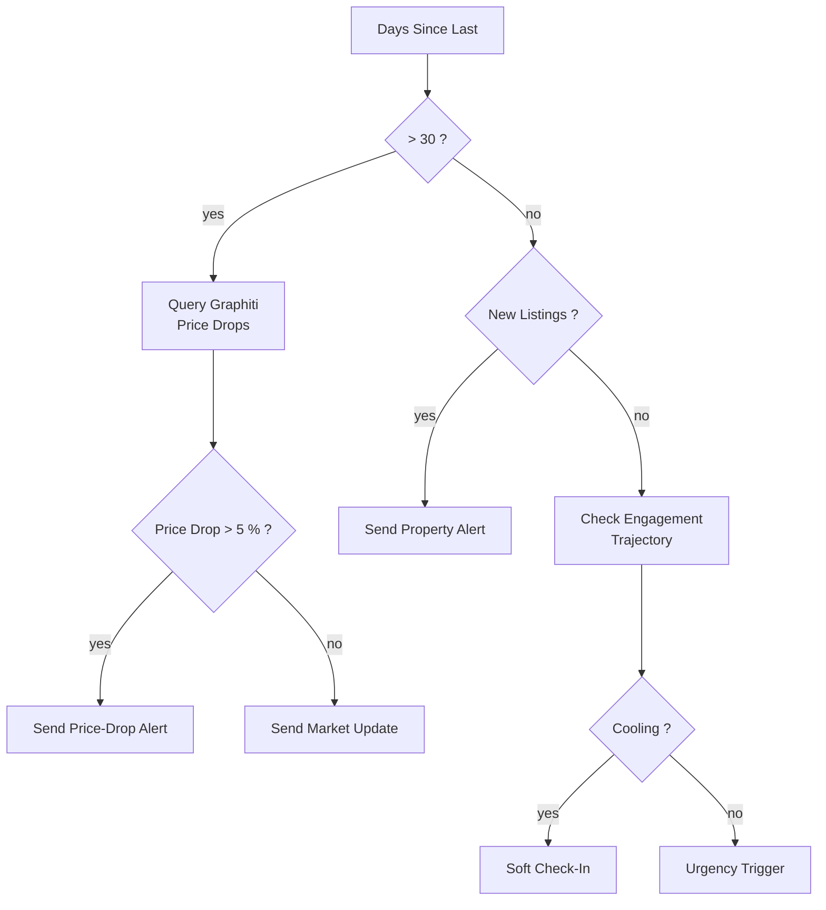
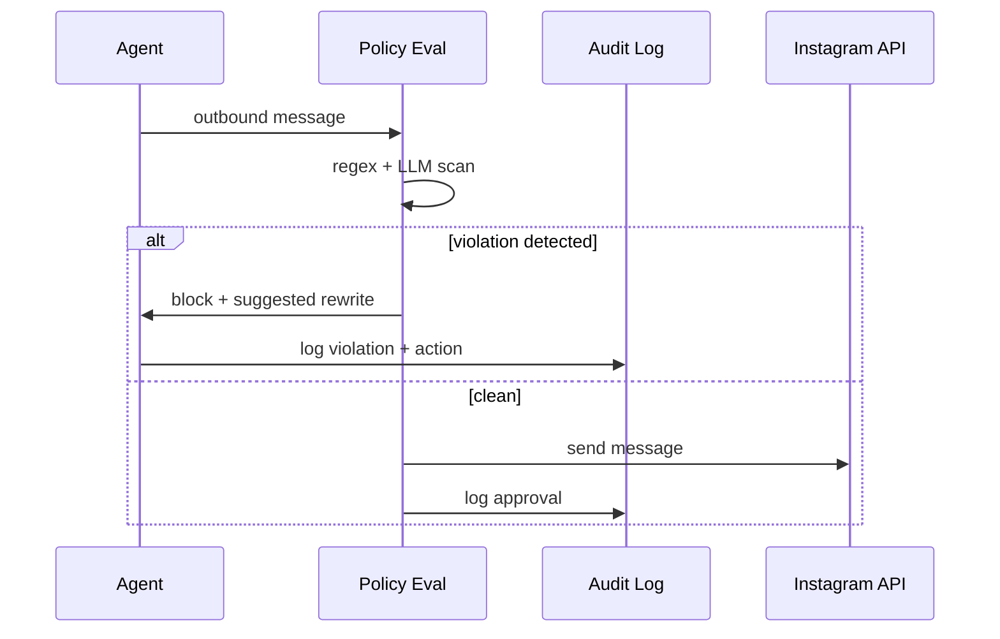
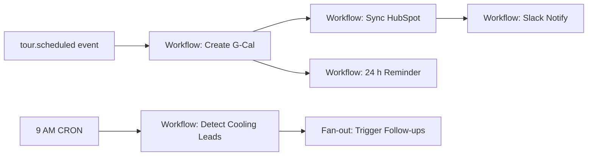

🎯 **Vertical Real Estate Agentic AI System**  
**Feature List + Workflow Diagram (Markdown)**

---

## 1. Core Features

| Module | Feature | Edge-Case Handling | Business Value |
|--------|---------|--------------------|----------------|
| **Lead Capture** | Instagram DM → sub-5 min AI reply | Rate-limit, spam filter, fair-housing gate | 60 % lead-loss → 5 % |
| **Router** | Intent classification (7 classes) | Low-confidence → human review | Zero mis-routing |
| **Qualifier** | Budget/BR/location extraction | Partial info, budget mismatch, no inventory | 70 % → 95 % accuracy |
| **Scheduler** | Multi-property tour optimizer | No slots, timezone, traffic delays | 30 % → 40 % booking rate |
| **Follow-Up** | Temporal nurture (price-drop, new listings) | Cooling leads, objections, market shifts | 3× re-engagement vs blast |
| **Compliance** | Fair-housing eval + immutable audit | Block & suggest safe rewrite | $0 lawsuit exposure |
| **Revenue Intel** | Lead-to-close attribution | Temporal causality queries | 2.3× close rate on matched listings |
| **CRM Sync** | HubSpot 2-way sync | Duplicate detection, field mapping | Single source of truth |
| **Calendar** | Google Calendar + Meet | Double-book guard, buffers, reminders | Zero no-shows |
| **Knowledge Graph** | Neo4j Graphiti temporal memory | Preference drift, similar-lead look-up | Context-aware every touch |

---

## 2. High-Level Workflow Diagram

---

## 3. Per-Agent Micro-Workflows

### 3.1 Router Agent

### 3.2 Qualifier Agent

### 3.3 Scheduler Agent

### 3.4 Follow-Up Agent

---

## 4. Compliance Workflow

---

## 5. Temporal Knowledge Graph Queries
| Query | Cypher Snippet | Use-Case |
|-------|----------------|----------|
| **Price drops on viewed properties** | `MATCH (l)-[:VIEWED]->(p) WHERE p.price < p.original_price RETURN p` | Urgency alert |
| **Preference drift** | `MATCH (l)-[f:FACT]->() WHERE f.valid_from > now() - 30 days RETURN f` | Adjust nurture |
| **Similar leads who closed** | `MATCH (l2)-[:OUTCOME]->(d {status:'closed'}) WHERE l2.budget ≈ l1.budget RETURN l2` | Learn winning patterns |

---

## 6. Event-Driven Orchestration (Inngest)

---

## 7. Failure & Retry Strategy
| Failure Point | Retry Policy | Fallback | Alert |
|---------------|--------------|----------|-------|
| Instagram API | 3× exponential | Buffer in KV | Slack |
| OpenRouter LLM | 2× + GPT-4o-mini | Static reply | Sentry |
| Google Calendar | 3× + 60 s backoff | Manual calendar link | Admin email |
| Neo4j Graphiti | 2× | Store in PG temporal table | Logger |
| RabbitMQ | auto-requeue | Dead-letter queue | Metrics |

---

## 8. Observability Dashboards
- **Langfuse**: LLM token cost, latency, accuracy per agent  
- **Sentry**: Error rate, retry count, fatal exceptions  
- **Redis Insights**: Checkpoint size, cache hit ratio  
- **Neo4j Bloom**: Knowledge-graph visual of lead journeys  
- **Grafana**: API latency, booking rate, compliance violations  

---

All workflows are **idempotent**, **horizontally scalable**, and **compliance-auditable** out of the box.