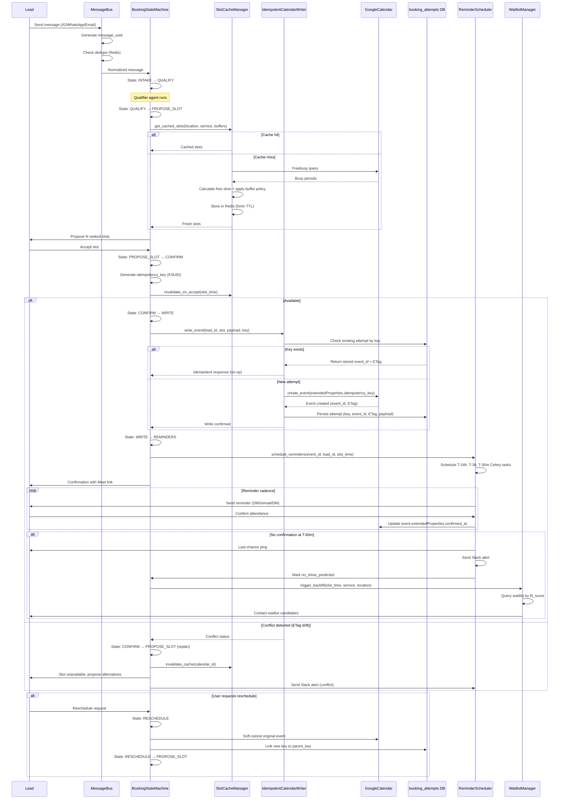

# Self-Driving Booking Ops 2.0

Production-ready booking orchestration system with idempotent calendar writes, multi-channel intake, and automated recovery for real estate lead management.

## Architecture Overview

The Self-Driving Booking Ops 2.0 platform transforms Instagram DM lead management into a fully automated booking system with the following key components:

### Core Components

- **BookingStateMachine**: Deterministic state orchestration (INTAKE → QUALIFY → PROPOSE_SLOT → CONFIRM → WRITE → REMINDERS)
- **MessageBus**: Multi-channel message normalization with UUID deduplication
- **IdempotentCalendarWriter**: KSUID-based conflict-free calendar operations with ETag validation
- **ReminderScheduler**: Multi-touch reminder cadence (T-24h, T-3h, T-30m) with confirmation tracking
- **WaitlistManager**: Automated backfill system for no-show recovery
- **SlotCacheManager**: Redis-backed availability caching with optimistic holds
- **ObservabilityMetrics**: SLA monitoring, conflict tracking, and Slack alerting

### Integration Points

- **Google Calendar API**: OAuth2 integration with Meet link generation
- **Redis**: State persistence, caching, deduplication, and circuit breaker patterns
- **Supabase**: PostgreSQL with RLS policies for data persistence
- **Celery**: Async task processing with retry logic
- **Multi-Channel Manager**: Instagram DM, WhatsApp, SMS, Email support

## State Machine Flow



## Setup Instructions

### Database Migrations

Run the new table creation script:

```sql
-- Execute CREATE_TABLES.sql modifications
-- Adds booking_attempts, waitlist, waitlist_attempts, booking_metrics tables
```

### Environment Variables

Add to your `.env` file:

```bash
# Booking Ops Configuration
SLACK_WEBHOOK_URL=https://hooks.slack.com/services/YOUR/SLACK/WEBHOOK
WHATSAPP_APP_SECRET=your_whatsapp_app_secret
WHATSAPP_PHONE_NUMBER_ID=your_phone_number_id
SENDGRID_API_KEY=your_sendgrid_api_key
MAILGUN_API_KEY=your_mailgun_api_key
BOOKING_WRITE_TIMEOUT_SECONDS=60
REMINDER_LEAD_TIMES=[1440,180,30]  # minutes: 24h, 3h, 30m
WAITLIST_MAX_ATTEMPTS=3
WAITLIST_MIN_NOTICE_HOURS=24
SLOT_CACHE_TTL_SECONDS=300
OPTIMISTIC_HOLD_TTL_SECONDS=900
ENABLE_MULTI_TOUCH_REMINDERS=true
ENABLE_WAITLIST_BACKFILL=true
ENABLE_SLACK_ALERTS=true
```

### Redis Keys

The system uses the following Redis key patterns:

- `booking_state:{lead_id}` - State machine state with 7-day TTL
- `message_claim:{uuid}` - Message processing claims with 1-hour TTL
- `processed_messages:{uuid}` - Processed message tracking with 7-day TTL
- `slots:{cache_key}` - Slot availability cache with 5-minute TTL
- `slot_hold:{lead_id}` - Optimistic slot holds with 15-minute TTL
- `reminder_schedule:{lead_id}` - Reminder tracking with 7-day TTL
- `backfill_state:{slot_time}` - Backfill attempt tracking with 24-hour TTL
- `calendar_etag:{calendar_id}` - Cache invalidation ETags (persistent)

### Celery Workers

Start Celery workers with the new task queues:

```bash
# Terminal 1: Main booking tasks
celery -A backend.celery_app worker --loglevel=info --queues=celery

# Terminal 2: Reminder tasks
celery -A backend.celery_app worker --loglevel=info --queues=reminders

# Terminal 3: Backfill tasks
celery -A backend.celery_app worker --loglevel=info --queues=backfill
```

### Webhook Configuration

#### Instagram Webhooks
- Endpoint: `POST /webhooks/instagram/comments`
- Verification: `GET /webhooks/instagram/comments` with `hub.verify_token`

#### WhatsApp Webhooks
- Endpoint: `POST /webhooks/whatsapp`
- Verification: `GET /webhooks/whatsapp` with signature validation

#### Email Webhooks
- SendGrid: `POST /webhooks/email/sendgrid`
- Mailgun: `POST /webhooks/email/mailgun`

## API Reference

### BookingStateMachine

```python
from backend.booking.booking_state_machine import BookingStateMachine

# Initialize
sm = BookingStateMachine()

# Transition states
next_state, actions = sm.transition(lead_id, current_state, event, context)

# Get current state
state = sm.get_state(lead_id)

# Set state
sm.set_state(lead_id, state, context, ttl=604800)
```

### MessageBus

```python
from backend.booking.message_bus import MessageBus

# Initialize
bus = MessageBus()

# Normalize message
normalized = bus.normalize_message('instagram', raw_payload)

# Check duplicates
is_dup = bus.is_duplicate(normalized.message_uuid)

# Claim for processing
claimed = bus.claim_message(normalized.message_uuid)

# Mark processed
bus.mark_processed(normalized.message_uuid, result)
```

### IdempotentCalendarWriter

```python
from backend.booking.idempotent_calendar_writer import IdempotentCalendarWriter

# Initialize
writer = IdempotentCalendarWriter()

# Write event
result = writer.write_event(lead_id, slot_time, event_payload, idempotency_key)

# Handle conflicts
replan = writer.handle_conflict(lead_id, slot_time)
```

### ReminderScheduler

```python
from backend.booking.reminder_scheduler import ReminderScheduler

# Initialize
scheduler = ReminderScheduler()

# Schedule reminders
result = scheduler.schedule_reminders(event_id, lead_id, slot_time, channel_prefs)

# Track confirmation
scheduler.track_confirmation(lead_id, event_id, confirmed_at)
```

### WaitlistManager

```python
from backend.booking.waitlist_manager import WaitlistManager

# Initialize
wm = WaitlistManager()

# Add to waitlist
wm.add_to_waitlist(lead_id, service, location, fit_score, responsiveness_score)

# Trigger backfill
result = wm.trigger_backfill(slot_time, service, location)
```

### ObservabilityMetrics

```python
from backend.booking.observability_metrics import ObservabilityMetrics

# Initialize
metrics = ObservabilityMetrics()

# Track metrics
metrics.track_write_latency(start_time, end_time, lead_id)
metrics.track_conflict_rate(total_writes, conflicts)

# Check SLAs
sla_status = metrics.check_sla_thresholds()
```

### SlotCacheManager

```python
from backend.booking.slot_cache_manager import SlotCacheManager

# Initialize
cache = SlotCacheManager()

# Get cached slots
slots = cache.get_cached_slots(location, service, duration, buffers)

# Cache slots
cache.cache_slots(location, service, duration, buffers, slots)

# Optimistic hold
held = cache.optimistic_hold(lead_id, slot_time)
```

## Troubleshooting Guide

### Redis Connection Issues

**Symptom**: Circuit breaker trips, operations fail
**Solution**:
1. Check Redis server status: `redis-cli ping`
2. Verify connection settings in `REDIS_URL`
3. Monitor circuit breaker: `get_redis_circuit_breaker_status()`
4. System operates in degraded mode without caching

### Calendar API Rate Limits

**Symptom**: Calendar operations fail with quota exceeded
**Solution**:
1. Implement exponential backoff in `GoogleCalendarClient`
2. Monitor usage in Google Cloud Console
3. Cache results more aggressively (increase TTL)
4. Batch operations where possible

### Webhook Signature Verification

**Symptom**: Webhooks rejected with 403
**Solution**:
- Instagram: Verify `META_APP_SECRET` matches Facebook app
- WhatsApp: Check `WHATSAPP_APP_SECRET` configuration
- Email: Verify SendGrid/Mailgun API keys and webhook secrets

### ETag Conflicts

**Symptom**: Calendar writes fail with conflict status
**Solution**:
1. Check calendar permissions (write access required)
2. Monitor concurrent operations on same calendar
3. Review ETag invalidation logic
4. Consider optimistic concurrency control adjustments

### Duplicate Message Processing

**Symptom**: Messages processed multiple times
**Solution**:
1. Verify Redis connectivity for deduplication
2. Check TTL settings on processing keys
3. Monitor message UUID generation
4. Review atomic claim logic in MessageBus

## Binary Acceptance Tests

### Performance Targets

- **Write Latency**: < 60 seconds P95
- **Response Time**: < 2 minutes P95
- **Show Rate**: +20% improvement vs baseline
- **Double-Books**: < 0.5% of bookings

### Reliability Targets

- **Uptime**: 99.9% booking availability
- **Conflict Rate**: < 2% of write operations
- **Idempotency Reuse**: > 80% cache hit rate
- **Message Deduplication**: 100% effectiveness

### Monitoring Commands

```bash
# Check system health
curl http://localhost:8000/health

# View metrics dashboard (if implemented)
curl http://localhost:8000/metrics

# Monitor Redis usage
redis-cli info | grep used_memory_human

# Check Celery queues
celery -A backend.celery_app inspect active
```

## Example Usage

### Complete Booking Flow

```python
from backend.booking.booking_state_machine import BookingStateMachine
from backend.booking.message_bus import MessageBus
from backend.booking.idempotent_calendar_writer import IdempotentCalendarWriter
from backend.booking.reminder_scheduler import ReminderScheduler

# Initialize components
sm = BookingStateMachine()
bus = MessageBus()
writer = IdempotentCalendarWriter()
reminders = ReminderScheduler()

# 1. Intake message via MessageBus
raw_message = {"text": "I'd like to schedule a tour", "from": "user123"}
normalized = bus.normalize_message('instagram', raw_message)

# 2. Initialize booking state
sm.set_state(normalized.lead_id, 'INTAKE', {})

# 3. Transition through qualification
sm.transition(normalized.lead_id, 'INTAKE', 'qualify_complete', {})

# 4. Propose slots (would integrate with scheduler agent)
slots = [...]  # From slot cache manager
sm.transition(normalized.lead_id, 'QUALIFY', 'slots_proposed', {'slot_candidates': slots})

# 5. User accepts slot
accepted_slot = slots[0]
sm.transition(normalized.lead_id, 'PROPOSE_SLOT', 'slot_confirmed', {'selected_slot': accepted_slot})

# 6. Idempotent calendar write
idempotency_key = "ksuid123"  # Generate KSUID
event_payload = {
    'start_time': accepted_slot['start'],
    'end_time': accepted_slot['end'],
    'summary': 'Property Tour',
    'attendee_emails': ['lead@example.com']
}
write_result = writer.write_event(normalized.lead_id, accepted_slot['start'], event_payload, idempotency_key)

# 7. Schedule reminders
reminders.schedule_reminders(write_result['event_id'], normalized.lead_id, accepted_slot['start'])
```

## Integration Patterns

### With Existing LangGraph Workflow

```python
# In your scheduler agent
from backend.booking.booking_state_machine import BookingStateMachine

def scheduler_node(state: AgentState) -> AgentState:
    sm = BookingStateMachine()

    # Check current booking state
    booking_state = sm.get_state(state.lead.id)
    current_state = booking_state.get('current_state', 'INTAKE') if booking_state else 'INTAKE'

    if current_state == 'PROPOSE_SLOT':
        # Use cached slots with buffer policy
        from backend.booking.slot_cache_manager import SlotCacheManager
        cache = SlotCacheManager()
        slots = cache.get_cached_slots(location, service, duration, buffers)

        # Transition and return slots
        sm.transition(state.lead.id, current_state, 'slots_proposed', {'slot_candidates': slots})
        return {**state, 'available_slots': slots}

    elif current_state == 'CONFIRM':
        # Write to calendar
        from backend.booking.idempotent_calendar_writer import IdempotentCalendarWriter
        writer = IdempotentCalendarWriter()

        lead = state.lead
        idempotency_key = lead.generate_idempotency_key()
        slot_time = state.selected_slot['start']

        result = writer.write_event(lead.id, slot_time, event_payload, idempotency_key)

        if result['status'] == 'conflict':
            # Replan
            sm.transition(lead.id, current_state, 'conflict_detected', {})
            return {**state, 'error_message': 'Slot unavailable, replanning'}
        else:
            # Success - schedule reminders
            from backend.booking.reminder_scheduler import ReminderScheduler
            reminders = ReminderScheduler()
            reminders.schedule_reminders(result['event_id'], lead.id, slot_time)

            sm.transition(lead.id, current_state, 'write_success', {})
            return {**state, 'meeting_link': result.get('meet_link')}
```

### Webhook Integration

```python
# In webhook handlers
from backend.booking.message_bus import MessageBus

@app.post("/webhooks/instagram/comments")
async def handle_instagram_webhook(request: Request):
    # ... existing webhook logic ...

    # Integrate MessageBus
    bus = MessageBus()
    normalized = bus.normalize_message('instagram', comment_data)

    if not bus.is_duplicate(normalized.message_uuid):
        bus.claim_message(normalized.message_uuid)

        # Process through booking flow
        # ...

        bus.mark_processed(normalized.message_uuid, {"status": "processed"})
```

This comprehensive system provides production-ready booking automation with observability, reliability, and multi-channel support for real estate operations.
